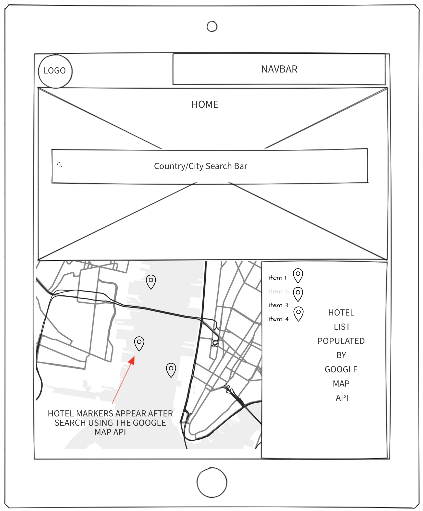
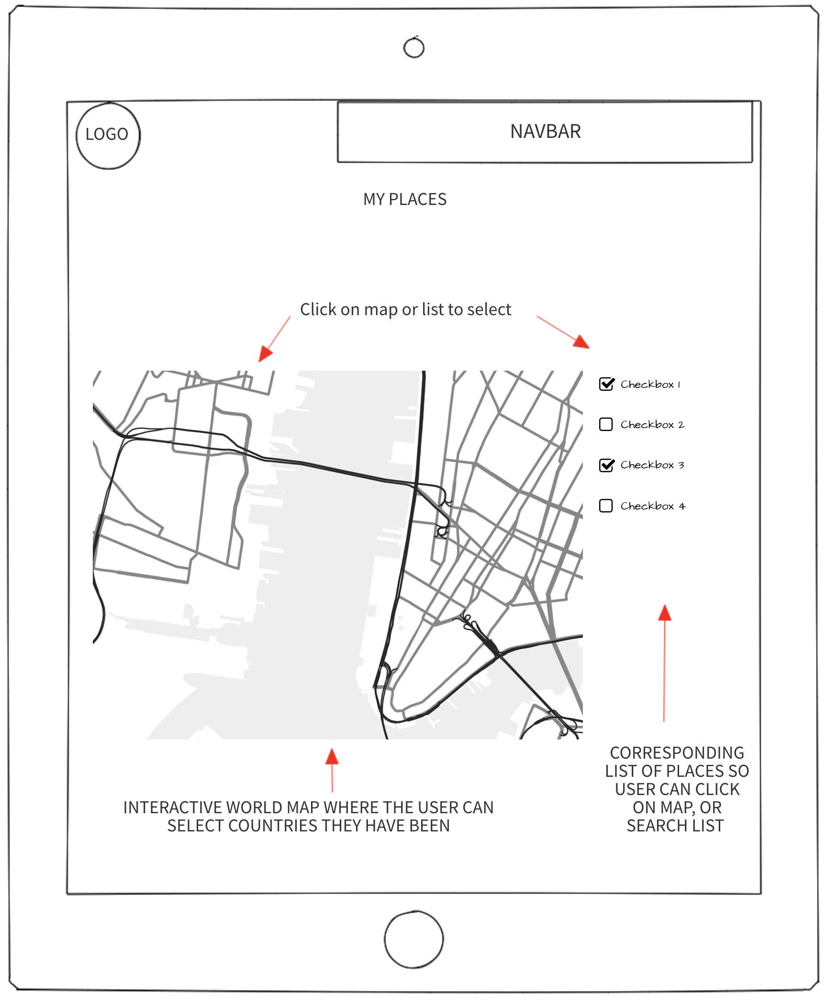
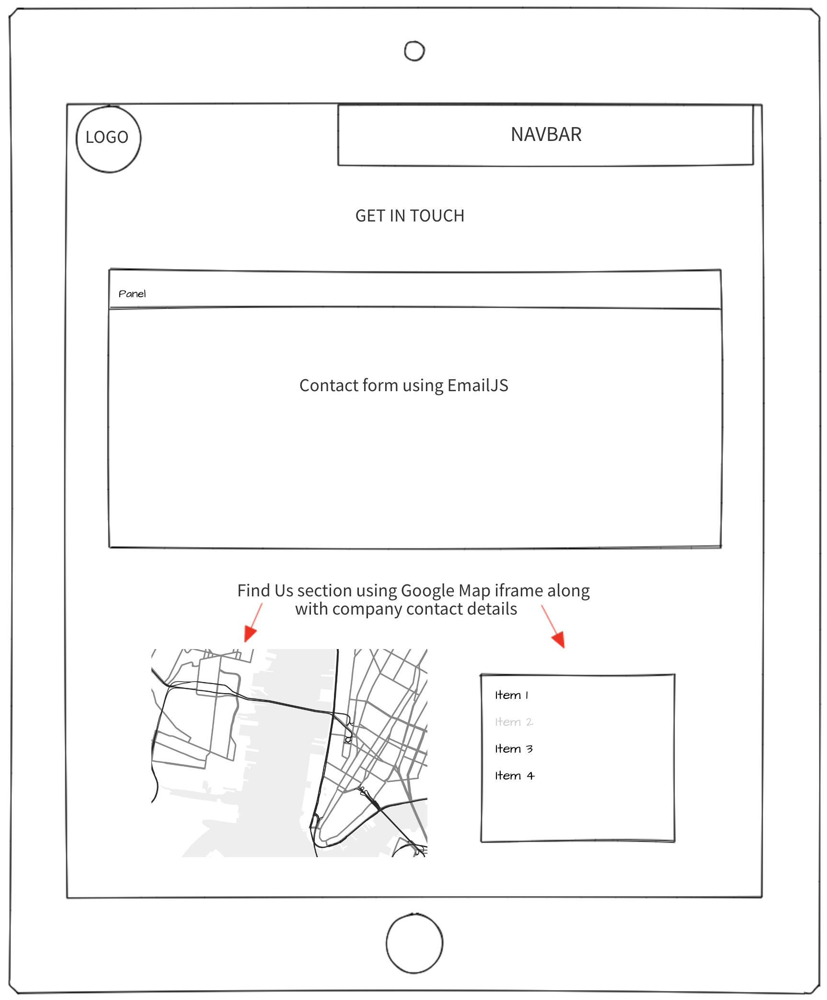
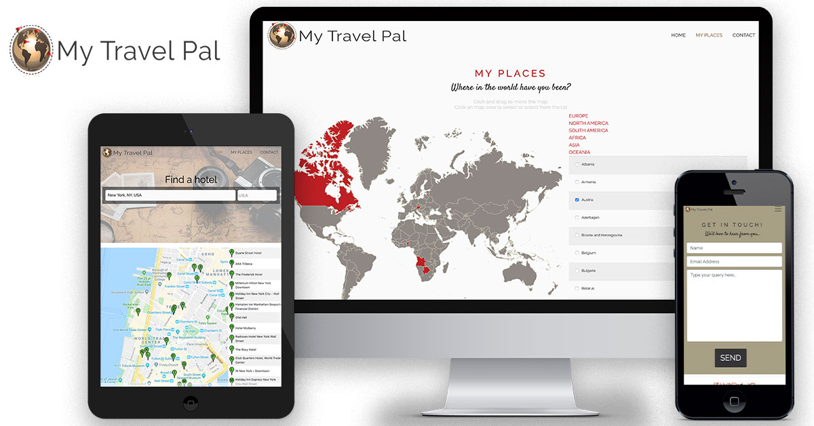

## Elaine Archbold Interactive Frontend Development Milestone Project

My plan for this site was to have an interactive travel site which would act as a search and log site, where you could search for hotels in a given location, but also have a section where you could store the places you have been. The goal being to both view your travels on an interactive map, and also search for new destinations.
I used the Google Places API with autocomplete on the home page and incorporated the “autocomplete” and “controls” fields into a search bar I created. I wanted to ensure the search bar took up a fair share of the screen, and to be obvious, which is why it stands out. The Google Map API returns results of hotels in the area searched and also gives information on those hotels.

Before getting started, I created basic wireframes of what I wanted the site to look like. See images below:

## UX

My goal in the design was to create a clean and simple look, with the main sections being bold and obvious. It was important that the site is responsive and very user friendly. I kept the colour palette simple with shades of browns to tie in with the background image and logo and added #be2026 for a highlight of colour.

I kept the Navbar and footer simple, going for a bootstrap light theme to ensure the hamburger Navbar menu icon would still be visible across each page.

####User A – Wants to search for hotels in a certain location. On the ‘Home’ page (index.html) there is a search bar linked to a Google Map. The user simply selects the country, enters in the city and the map will populate with markers showing hotels in the vicinity. It also shows the hotels in a list in order of distance from the marker. This is fully interactive and pulls details on each hotel as you hover or click over a marker.

####User B – Wants to select and store all of the places they have been, to have a visual representation on a map of how far they have travelled. On the ‘My Places’ page, the map is fully interactive. The user can click an area on the map or select the location on the list and this country is selected and changes colour. I have written cookies to store these details so that everything will remain the same the next time the user visits the site.

####User C – Wants to get in touch with a query. On the ‘Contact’ page, I have an interactive form using EmailJS, as well as contact details and a Google Map iframe showing the location of the business.

## Features
### Existing Features
HOME PAGE – I have set a welcome/welcome back cookie storing the users name to either welcome or welcome them back to the site. 
There is a Google Map & search bar which I have linked in with the Google Place API id fields. The user can enter a location and nearby hotels will populate into the map my way of a marker. A list is also populated alongside the map and the user can click on either the marker or the list to find more information on that particular hotel.

PLACES VISITED PAGE - I have an interactive 'Places Visited' map on the 'My Places' page with cookies to store the users selected locations. The user can either click on the map or select a country from the list to add it to their selection. Once selected, the country changes colour. The user can immediately see how much of the world they have visited, and how much more travelling they have yet to do.

CONTACT PAGE – There is a contact form on the contact page, created with EmailJS. The parameters have been set and it has been tested to ensure it is working correctly. 

## Technologies Used
1. HTML
2. CSS
3. Bootstrap (4)
4. JavaScript
5. Google Places API
6. EmailJS
7. JQuery
8. Photoshop
9. Illustrator

## Testing
The site has been tested for responsiveness on Chrome, Safari and Firefox.

All HTML was checked on the W3C Mark-up Validation Service.

The CSS was checked on the W3C CSS Validation Service.

All HTML was formatted on https://freeformatter.com.

All links have been tested.

The contact form has been tested and is working correctly.

Screenshots of the responsive design can be seen here:

## Deployment
The site has been deployed to GitHub pages and can be viewed here: https://elainearchbold.github.io/Interactive-Frontend/

## Credits
### Content
I followed the Google Places API instructions from the Google API tutorial (https://developers.google.com/places/web-service/autocomplete). This was added to and styled for use on 'Index.html'.
I used AM Charts interactive map (https://www.amcharts.com/visited_countries/#) for the 'My Places' page and styled this to suit the theme. I also added to their JavaScript to create custom cookies to store the user selections. 

### Media
The image used on the 'Index' page is from unsplash : Image credit "Photo by Dariusz Sankowski on Unsplash"
The globe used in the logo is from all-free-download.com (https://all-free-download.com/free-vector/download/travel-icons-set_6813457.html) and was changed using Photoshop, and then added to Illustrator to create the logo. 

### Acknowledgements
My mentor Reuben Ferrante was a great source of help for setting the cookies on the interactive map.
